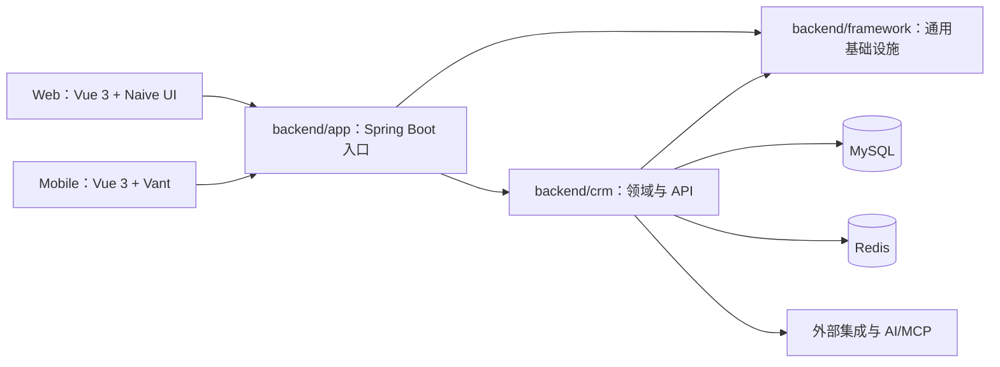

# 系统架构

## 总体结构

Cordys CRM 采用前后端分离的多模块架构。桌面端与移动端通过 HTTP API 访问 Spring Boot 应用；业务数据存储在 MySQL，缓存与会话由 Redis 支撑。安装和运行时编排集中在 `installer/`。

## 后端边界

`backend/app` 聚合 `framework` 与 `crm`，负责启动、资源装配和制品打包。`backend/framework` 提供安全、文件、持久化扩展、上下文等通用能力。`backend/crm` 按线索、客户、商机、合同、订单、产品、审批和系统管理等领域拆分；每个领域通常包含 Controller、Service、Mapper、Domain 和 DTO。

典型请求依次经过 Controller 参数与权限处理、Service 业务编排、Mapper 数据访问。领域间协作应通过明确的 Service 边界完成，避免 Controller 直接访问其他领域 Mapper。

## 前端边界

`frontend` 使用 pnpm workspace。`web` 与 `mobile` 分别维护端侧页面、路由、布局和 UI 组件；`lib-shared` 保存无端侧依赖的共享模型、请求定义和工具。前端 API 层与后端接口契约保持一致，公共类型优先集中维护，避免两端各自复制。

## 配置与部署

应用默认端口为 `8081`。通用 Spring 配置位于 `backend/app/src/main/resources/commons.properties`，部署示例位于 `installer/conf/cordys-crm.properties`。容器与启动脚本位于 `installer/`。配置文件不得包含生产凭据；密钥和环境差异应由部署环境注入。

## 架构变更原则

新增模块前先判断能否归入现有领域。跨模块依赖应保持 `app -> crm -> framework` 的方向，禁止 `framework` 依赖具体 CRM 业务。涉及接口、数据模型、权限边界或外部集成的变更，应同步更新测试与本文件。

